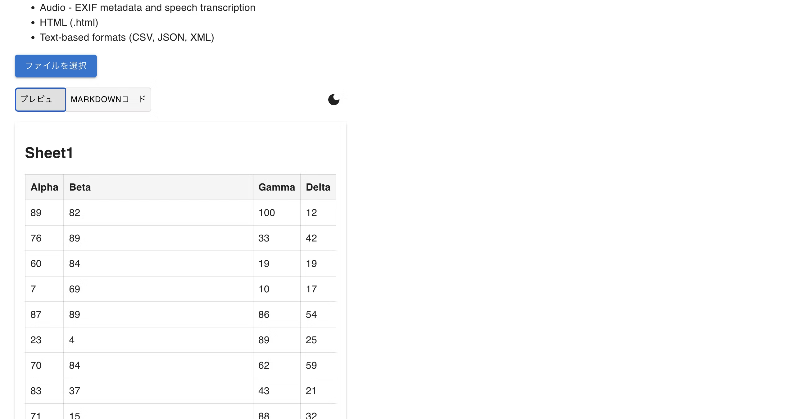

## サービスの思い
このプロジェクトはMicroSoft社が公開したMarkitDownを使用して開発したアプリです。
PowerPointやExcelなどOffice365サービスやHTMLや画像ファイルなど様々なファイル形式をMarkDownに変換できます。
2025年1月の時点でファイルをアップロードすることでMarkDownコードの表示やプレビューを見ることができます。
今後はMDファイルのダウンロード機能やコピー機能、複数のファイルアップロード機能など追加していきたいと考えています。

## 機能一覧
### pptxファイルのMarkDown化
| 初期画面 | 使用するpptxファイル |
| --- | --- |
|||
|初期画面です|公式リポジトリのpptxファイルを使用します|

|プレビュー画面|MDコード画面|
| --- | --- |
|||
|MarkDown化した時のプレビューが表示されます|MarkDown化した時のコードが表示されます|

### xlsxファイルのMarkDown化
| 初期画面 | 使用するxlsxファイル |
| --- | --- |
||||
|初期画面です|公式リポジトリのxlsxファイルを使用します|

|プレビュー画面|MDコード画面|
| --- | --- |
|||
|MarkDown化した時のプレビューが表示されます|MarkDown化した時のコードが表示されます|

## 使用技術
|カテゴリー|フレームワーク・言語・技術|
| --- | --- |
|フロントエンド|React+Vite, TypeScript|
|バックエンド|Python, flask, MarkitDown|
|デザイン|Figma|

## 構成図

## 今後の展望
- 複数のファイルアップロード機能の追加
- MDファイルのダウンロード機能の追加
- コピー機能の追加